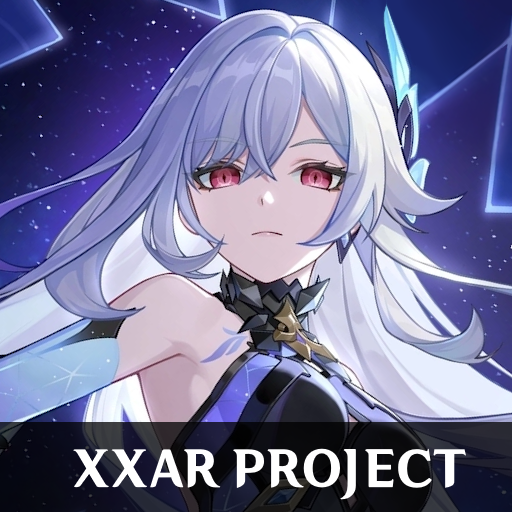

<p align="center">
  
</p>

<h1 align="center">XXAR</h1>
<p align="center"><b>Cross-game Audio Replacer</b></p>

<p align="center">
  Replace any sound in your favorite HoYoverse games with your own audio.<br/>
  Supports <b>Zenless Zone Zero</b>, <b>Genshin Impact</b>, and <b>Honkai Star Rail</b>.<br/>
  Built-in mod manager, audio browser, GameBanana integration, and format converter.
</p>

<p align="center">
  
  
  
  
  
</p>

---

## What is XXAR?

XXAR is a **Mod Manager** and a **Mod Creator** for HoYoverse game audio.

Want to just install mods? It's as easy as clicking install, selecting your mod file, and enabling it.

Are you a mod creator? Click "Import Non-XXAR Mod", select your loose `.wem` files or built `.pck` file, and export it as a ready-to-share mod package.

You can replace any audio in the supported games: character voice lines, sound effects, music, basically everything. No command line required. Pick the sound you want to change, select your replacement or mute it, and you're good to go. XXAR handles all the format conversion and packages everything into installable mod files.

### Supported Games

| Game | Mod Format | Status |
|------|-----------|--------|
| Zenless Zone Zero | `.zzar` | Full support |
| Genshin Impact | `.giar` | Full support |
| Honkai Star Rail | `.srar` | Full support |

## Features

- **Multi-Game Support** - Switch between ZZZ, Genshin Impact, and HSR with a single click. Each game has its own theme, branding, and mod library.
- **Mod Manager** - Install, enable/disable, and manage audio mods. Handles conflicts when multiple mods replace the same sound.
- **Audio Browser** - Browse every sound in the game, organized by type and language. Preview, play, replace, or mute sounds right in the app. You can even rename sounds and give them searchable tags.
- **GameBanana Integration** - Browse, download, and install audio mods directly from GameBanana for each supported game.
- **Mod Creator / Converter** - Build your own mod packages or convert existing loose-file mods into the XXAR format.
- **Audio Converter** - Convert between MP3, WAV, OGG, FLAC, AAC, M4A, and WEM. XXAR handles the Wwise encoding automatically. Supports batch conversion and LUFS-based audio normalization.
- **Auto Updater** - Automatically updates XXAR when a new version is released.
- **Cross-Platform** - Works on both Windows and Linux (Flatpak available).
- **Translations** - Available in English, Spanish, and Japanese.

## Planned Features

See all our [Planned Features](FEATURES.md).

## Getting Started

### Option 1: Pre-built Release (Recommended)

Grab the latest release from the [Releases](../../releases) page.

- **Windows:** Download `XXAR-Installer-v*.msi` (or the portable `XXAR-windows-x64.zip`)
- **Linux:** Download `XXAR-linux-x86_64.flatpak` and install it with
  `flatpak install --user XXAR-linux-x86_64.flatpak`. After that the app
  auto-updates from inside via subsequent bundles.

### Option 2: Run from Source

```bash
# Clone the repo
git clone https://github.com/Entity378/XXAR.git
cd XXAR

# Install dependencies
pip install -r requirements.txt

# Launch
python XXAR.py
```

Or use the provided launcher scripts:
- **Windows:** `start_gui.bat`
- **Linux:** `start_gui.sh`

### First Launch

On first launch, XXAR will try to auto-detect your game installation. If it can't find it, point it to the game's data folder (e.g., `ZenlessZoneZero_Data`, `GenshinImpact_Data`, or `StarRail_Data`).

You'll also be prompted to set up **Wwise** (needed for converting audio to the game's format) and **FFmpeg/vgmstream** (for general audio conversion). The app auto-installs both.

## How It Works

HoYoverse games store their audio inside `.pck` files. The sounds the game actually plays live inside `.bnk` SoundBank files, which are nested inside those `.pck` archives. XXAR knows how to dig into that structure, pull out individual sounds, replace them with yours, and repack everything so the game loads it correctly.

```
SoundBank_SFX_1.pck
└── 428903628.bnk
    ├── 134133939.wem    <- this is what the game plays
    ├── 18063035.wem
    └── ...
```

> **Heads up:** The games also have `Streamed_SFX_*.pck` files that contain the same sound IDs, but the game **doesn't always use those**. XXAR targets the correct SoundBank files so your mods actually work.

## Requirements

(Only applies if running from source)

- **Python 3.11+**
- **PyQt5**
- **FFmpeg** - for audio format conversion (Linux)
- **vgmstream** - for WEM playback and conversion (Linux)

XXAR can set up FFmpeg, vgmstream, and Wwise for you through the built-in setup wizards.

## Contributing

Found a bug or have an idea? Open an issue! Pull requests are welcome too.

## Credits

- **[Pucas01](https://github.com/Pucas01)** - Original creator of ZZAR, the project this fork is based on. Licensed under GPL-3.0.
- **failsafe65** - For making the original audio modding scripts.
- **mob159** - For improving on failsafe65's PCK extraction and packing scripts which have been used as reference.
- **Thoronium** - For making HAMM and for making the Wwise project file.
- **noirs_rf** - For making a free concept ZZZ design which this program's design is based on.
- **Retrotecho** - For making the first ZZAR logo design.
- **alver_418** - Maker of Zenless Tools, for making the Chat generator which assets of it were used.

### Testers

- **mob159** - For helping me out the most during development.
- **Marbles** - For helping me to do some testing and providing feedback.
- **Skysill** - For helping me test the linux build.

### Translators

- **Luafile_Gabriel** - Spanish translation.

## License

XXAR is licensed under the [GNU General Public License v3.0](LICENSE).

## Disclaimer

XXAR is a fan-made tool and is not affiliated with HoYoverse. Use at your own risk.
